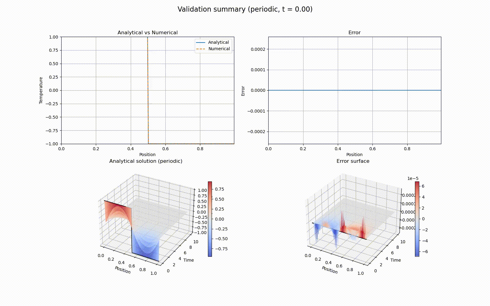
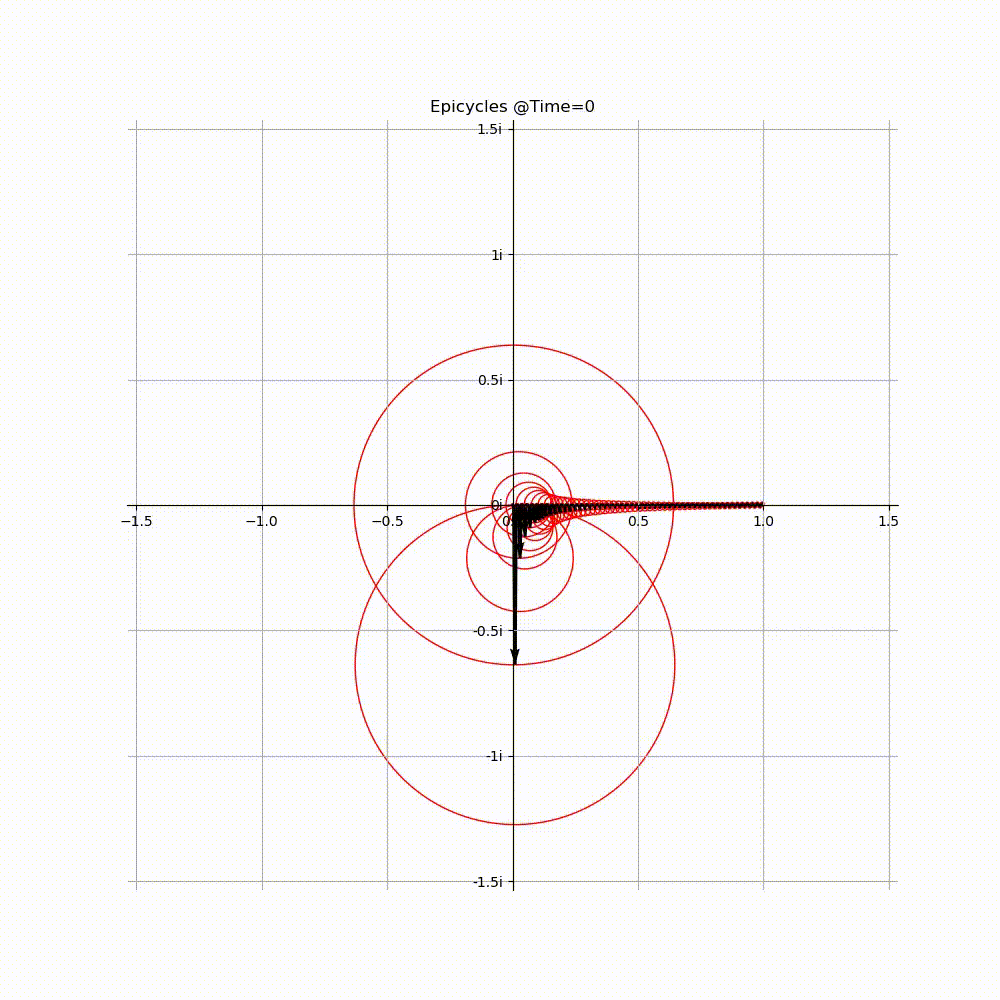

# Fourier Diffusion

Small Python project for Fourier-based analytical solutions and numerical validation of the 1D heat (diffusion) equation.



Analytical Fourier solution and finite-difference validation evolving over time.

## Fourier reconstruction



Fourier modes represented as rotating complex vectors that reconstruct the periodic signal.

## Current scope

- build simple 1D signals
- compute Fourier coefficients
- reconstruct partial sums
- compute analytical diffusion solutions
- visualize signals, epicycles, and temperature evolution

## Validation

This project includes a comparison between analytical Fourier-based solutions and a numerical finite-difference solver for the heat equation, with error quantification and visualization.

## Highlights

- Analytical solution of the 1D heat equation using Fourier series
- Explicit finite-difference solver with stability control
- Quantitative validation using error metrics (max and RMS error)
- Visualization of solutions and error evolution
- Combined validation summary plots (static and animated)

## Run

```bash
python run_example.py
``` 

## Purpose

This project was developed as a learning and validation tool for understanding diffusion processes and numerical methods, with the long-term goal of building a Navier–Stokes solver.